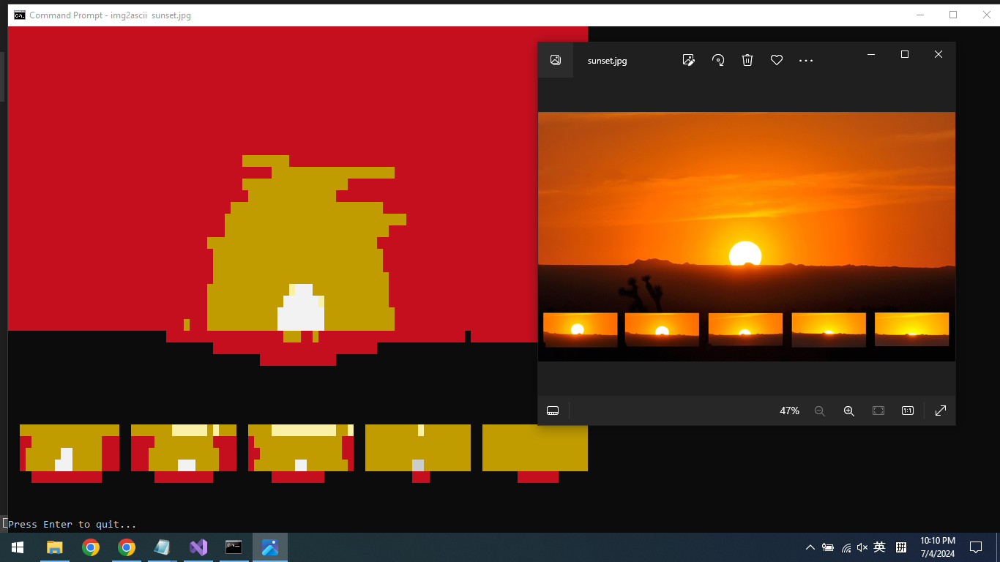
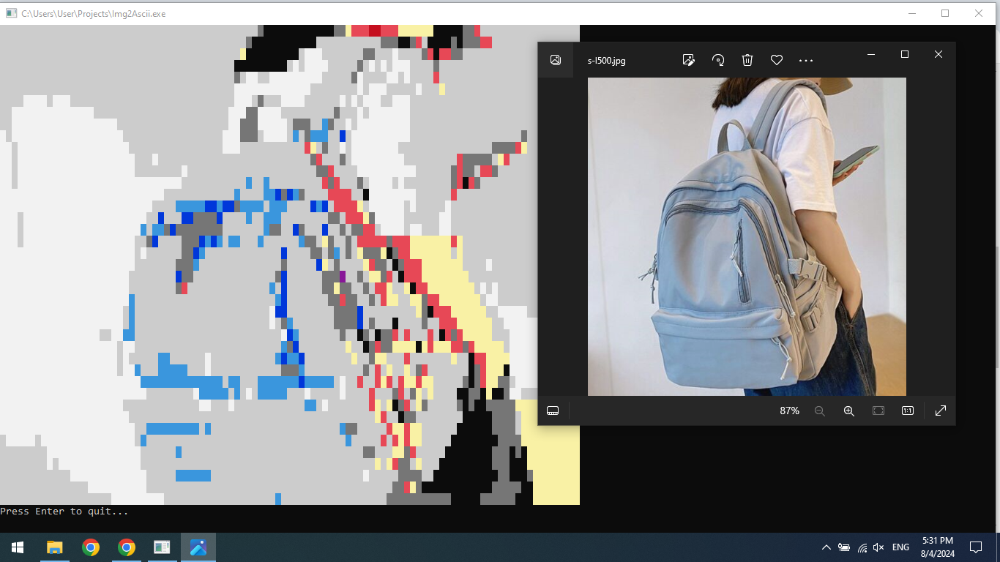

# Img2Ascii

Convert image file (including animated GIF) to 16-color ANSI art

## Screenshot

## How to build

1. Create a C# Console App project (.NET Framework 4.8, for example)

2. Copy & paste the content of `Program.cs`

3. Go to Solution Explorer, right-click References, and select Add Reference. 

4. Tick "System.Drawing" and close the dialog

5. Build the solution

## How to run

If your project name is Img2Ascii, then just type:

`Img2Ascii <image filename>`

Or you can just drag an image file and drop it on top of `Img2Ascii.exe` program icon.

The converted ANSI art will be shown on console screen, and prompt you to press Enter to quit.

## License 

MIT license apply.
